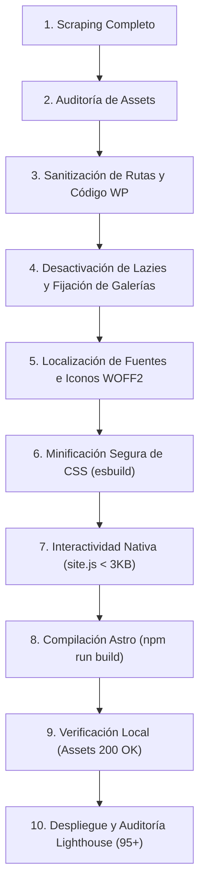

# Protocolo Definitivo: Migración de WordPress + Elementor a Astro Puro

Esta guía documenta el método exacto, las lecciones aprendidas y el **prompt maestro** para solicitar y ejecutar la conversión de cualquier sitio WordPress (especialmente con Elementor) a **Astro puro**, logrando:
- **100% fidelidad visual idéntica al diseño original**.
- **0 rastros de WordPress** (código limpio, rutas `/assets/`, sin `/wp-content/` ni `admin-ajax.php`).
- **Puntuación de rendimiento 95-100 en Desktop y 90+ en Mobile** en PageSpeed / Lighthouse.
- **Sin errores de imágenes ocultas, iconos rotos o CSS destrozado**.

---

## 1. El Prompt Maestro (Cómo solicitar la migración)

Cuando quieras iniciar una nueva migración en cualquier proyecto, copia, completa y envía este prompt al agente:

````markdown
Quiero migrar este sitio de WordPress con Elementor a un proyecto Astro puro, estático y ultrarrápido.
URL original / Archivos descargados: [PEGAR URL O RUTA]

Requisitos obligatorios y restricciones estrictas:
1. FIDELIDAD VISUAL 100%: El diseño, tipografías, colores, espaciados, imágenes y animaciones deben ser idénticos al sitio original.
2. CERO RASTROS DE WORDPRESS:
   - Eliminar cualquier referencia a `wp-content`, `wp-includes`, `admin-ajax.php`, `wpadminbar`, plugins (`elementor`, `royal-addons`, etc.) o URLs internas de WP.
   - Renombrar todas las carpetas y rutas de assets a rutas limpias de Astro (`/assets/`, `/images/`, `/fonts/`, `/webfonts/`, `/css/`, `/js/`).
   - Meta tags y generator deben identificar el sitio como Astro puro.
3. PREVENCIÓN DE ERRORES DE ELEMENTOR (OBLIGATORIO):
   - Eliminar cualquier bloque inline `<style>` con reglas de lazyload como `background-image: none !important;`.
   - Asegurar la clase `e-lazyloaded` en todos los contenedores `.e-con.e-parent`.
   - Si existen galerías con `data-thumbnail`, inyectar directamente `style="background-image: url('...'); background-size: cover; background-position: center;"` y verificar que las imágenes existan en disco.
   - Headers: eliminar estilos inline fijos del scraping (`position: fixed; width: 2000px; top: 32px;`) y usar `position: sticky; top: 0; width: 100%; z-index: 999;`.
4. ICONOS Y TIPOGRAFÍAS 100% LOCALES:
   - Descargar localmente todas las fuentes de Google Fonts y las fuentes de iconos necesarias (`fa-solid-900.woff2`, `fa-regular-400.woff2`, `fa-brands-400.woff2`, `fontawesome-webfont.woff2`, `eicons.woff2`) en formato WOFF2 con `font-display: swap;`. No depender de CDNs externos.
   - Normalizar CSS para SVGs (`.e-font-icon-svg { width: 1em; height: 1em; fill: currentColor; display: inline-block; vertical-align: middle; }`).
5. CSS Y RENDIMIENTO:
   - NO usar PurgeCSS ni eliminadores agresivos de CSS que rompan variables de Elementor (`--e-global-...`) o selectores anidados. Minificar de forma segura con herramientas AST como `esbuild`.
   - Reemplazar scripts pesados de WP (jQuery, plugins JS de 500KB) por un único script nativo ligero (`site.js`) para menú hamburguesa, desplegables y scroll suave.
6. VERIFICACIÓN OBLIGATORIA ANTES DE ENTREGAR:
   - Comprobar que ningún asset retorne 404.
   - Ejecutar auditoría Lighthouse en producción y asegurar 95+ en Desktop y 90+ en Mobile.
````

---

## 2. Las 7 Trampas Clásicas de Elementor y Cómo Evitarlas

### Trampa 1: El Fallback Asesino de Lazyload (`background-image: none !important`)
- **El Problema:** Elementor inserta en el `<head>` una regla para diferir imágenes:
  ```css
  .e-con.e-parent:nth-of-type(n+4):not(.e-lazyloaded) * { background-image: none !important; }
  ```
  Al quitar el JS pesado de Elementor, los contenedores nunca reciben la clase `.e-lazyloaded`. El navegador aplica la regla y **oculta absolutamente todas las imágenes de fondo, tarjetas y banners de la página**.
- **La Solución Inmediata:**
  1. Regex para eliminar el `<style>` del lazyload en todos los HTMLs:
     ```js
     html = html.replace(/<style>[^<]*\.e-con\.e-parent:nth-of-type[\s\S]*?background-image:\s*none\s*!important;[\s\S]*?<\/style>/gi, '');
     ```
  2. Inyectar `e-lazyloaded` en todos los `.e-con.e-parent`.

---

### Trampa 2: Galerías y Portafolios sin Imágenes en el HTML
- **El Problema:** Los widgets de galería de Elementor dejan los divs de imagen vacíos:
  ```html
  <div class="e-gallery-image" data-thumbnail="https://sitio.com/wp-content/.../foto.jpg"></div>
  ```
  Esperan que `e-gallery.min.js` inyecte el `background-image` en tiempo de ejecución. Además, los scrapers web tradicionales suelen omitir descargar los archivos de `data-thumbnail`.
- **La Solución Inmediata:**
  1. Descargar todos los archivos listados en atributos `data-thumbnail` o `data-src`.
  2. Inyectar el estilo directamente en el HTML estático:
     ```html
     <div class="e-gallery-image" data-thumbnail="/assets/2024/02/foto.jpg" style="background-image: url('/assets/2024/02/foto.jpg'); background-size: cover; background-position: center;"></div>
     ```

---

### Trampa 3: Iconos Rotos (El dilema Font Awesome vs SVG)
- **El Problema:** Elementor mezcla dos sistemas de iconos:
  1. **Pseudo-elementos con fuentes:** Reglas CSS como `.wpr-sub-icon:before { content: "\f0d7"; font-family: "Font Awesome 5 Free"; font-weight: 900; }`. Si falta el archivo `.woff2`, el navegador muestra un recuadro roto `□`.
  2. **SVGs inline sin atributos de tamaño:** `<svg class="e-font-icon-svg" viewBox="0 0 448 512">` sin `width` ni `height`. Sin el CSS de Elementor, el SVG colapsa a 0px o se expande a 100% deformando el navbar.
- **La Solución Inmediata:**
  1. Alojar localmente en `/webfonts/` y `/fonts/`:
     - `fa-solid-900.woff2`
     - `fa-regular-400.woff2`
     - `fa-brands-400.woff2`
     - `fontawesome-webfont.woff2` (FontAwesome 4)
     - `eicons.woff2` (iconos nativos de Elementor)
  2. Normalizar el CSS universal para SVGs:
     ```css
     .e-font-icon-svg {
       width: 1em;
       height: 1em;
       display: inline-block;
       fill: currentColor;
       vertical-align: middle;
     }
     svg.e-font-icon-svg path { fill: currentColor; }
     .jkit-hamburger-menu svg { width: 24px; height: 24px; fill: #fff; }
     .jkit-close-menu svg { width: 20px; height: 20px; fill: #fff; }
     ```

---

### Trampa 4: Sticky Header Roto por Inline Styles del Scraper
- **El Problema:** Al hacer scraping de una página cuando el header estaba en modo sticky o con la barra de admin de WordPress abierta, el HTML se guarda con estilos inline quemados:
  ```html
  <header style="position: fixed; width: 2032.8px; top: 32px; ...">
  ```
  Esto bloquea el responsive en móviles y deja un espacio blanco superior de 32px.
- **La Solución Inmediata:**
  Reemplazar siempre por el estándar CSS sticky moderno:
  ```html
  <header style="position: sticky; top: 0; width: 100%; z-index: 999;">
  ```

---

### Trampa 5: La Destrucción por PurgeCSS
- **El Problema:** Herramientas como PurgeCSS o UnCSS analizan el HTML y eliminan selectores que no ven explícitamente en el DOM (como clases añadidas por JS, variables CSS de Elementor `--e-global-color-...` o selectores de estado `:hover`, `:focus`). El sitio pierde su paleta de colores y componentes enteros se deforman.
- **La Solución Inmediata:**
  **Nunca usar PurgeCSS en bundles de Elementor**. Utilizar minificación sintáctica pura con `esbuild`:
  ```js
  const esbuild = require('esbuild');
  esbuild.buildSync({
    entryPoints: ['input.css'],
    outfile: 'output.min.css',
    minify: true
  });
  ```
  Esto reduce el tamaño un 35-45% sin romper ni una sola regla o variable.

---

### Trampa 6: Trazas Ocultas de WordPress
- **El Problema:** El cliente o usuario inspecciona el código o la pestaña *Network* y encuentra:
  - Rutas `/wp-content/uploads/...`
  - Llamadas a `/wp-admin/admin-ajax.php`
  - Comentarios `<!-- This website is powered by Elementor... -->`
  - Scripts de `wordfence`, `wp-emoji`, etc.
- **La Solución Inmediata:**
  1. Script automatizado de reemplazo de cadenas para sanitizar todo a `/assets/` y `/css/`.
  2. Regex para podar scripts virtuales (`//# sourceURL=...`) y bloques inline de configuración `elementorFrontendConfig` o `wp-api`.

---

### Trampa 7: Interactividad Pesada de WordPress vs Interactividad Ligera
- **El Problema:** Un sitio Elementor típico carga entre 1.5MB y 3MB de JavaScript (`jquery.min.js`, `core.min.js`, `frontend.min.js`, `swiper.min.js`, `e-gallery.min.js`, etc.). Esto destruye la métrica TBT (Total Blocking Time) y hunde la puntuación móvil por debajo de 50.
- **La Solución Inmediata:**
  En el 95% de los sitios corporativos o landing pages, toda la interactividad real se reduce a:
  1. Menú hamburguesa móvil (abrir/cerrar).
  2. Desplegables de submenú (acordeón o dropdown).
  3. Scroll suave a anclas (`#servicios`, `#contacto`).
  
  Todo esto se resuelve con **menos de 2 KB de Vanilla JS nativo** en un único archivo `/js/site.js` con atributo `defer`.

---

## 3. Matriz de Flujo de Trabajo (Paso a Paso)



---

## 4. Checklist de Validación Final

Antes de dar por concluida la migración, ejecutar estas comprobaciones:

| Punto de Control | Método de Verificación | Estado Esperado |
| :--- | :--- | :--- |
| **Imágenes de Fondo** | Revisar en DevTools Elements que ningún contenedor tenga `background-image: none !important`. | 100% visibles en desktop y móvil |
| **Galerías** | Inspeccionar `.e-gallery-image`. Deben tener `style="background-image: url(...)"`. | 0 galerías vacías |
| **Iconos SVG** | Verificar menú hamburguesa, botón cerrar y flechas de botones. | Tamaño `1em` o explícito, sin desbordamientos |
| **Iconos de Fuentes** | Buscar pseudo-elementos `:before` con `content: "\f..."`. | Renderizan glifo correcto, 0 recuadros vacíos |
| **Assets 200 OK** | Script automatizado que haga `HEAD` request a todas las URLs referenciadas. | 0 errores 404 |
| **Pureza Astro** | Búsqueda global en `/dist/` de la palabra `wp-content`. | 0 ocurrencias |
| **Header Sticky** | Probar scroll vertical en resolución de 375px (iPhone) y 1440px (Desktop). | Fijo arriba, 100% ancho, sin saltos |
| **Lighthouse** | Ejecutar `npx lighthouse <URL> --preset=desktop` y en mobile. | Desktop: **95-100**, Mobile: **90+** |
